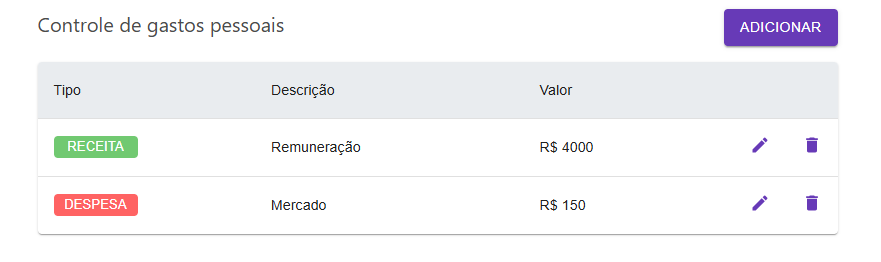

# Controle de gastos pessoais

Um aplicativo simples para controle de despesas pessoais, desenvolvido com foco em monitorar gastos e gerenciar o orçamento de maneira intuitiva.


## Visão Geral
O Controle de Gastos permite que você registre suas despesas e receitas, oferecendo uma visão geral do seu orçamento e dos gastos mensais. Este projeto foi criado para ajudar usuários a controlar suas finanças de maneira prática e acessível.



## Tecnologias Utilizadas
- Vite
- React
- Javascript
- Material UI

## Instalação

Clone o repositório para o seu ambiente local:

```bash
git clone https://github.com/kellpf/controle-gastos.git
```

Instale as dependências:

```bash
npm install
```

Inicie o servidor de desenvolvimento:

```bash
npm run dev
```
